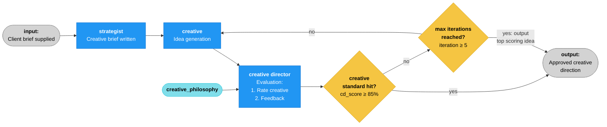

# 🌊 agt_sea

An AI-powered creative marketing tool for brands and agencies offering a number of services designed to improve creative output. 

At present, agt-sea just contains a single module but more are planned to follow.

Current module: Creative agency framework — three AI agents collaborate to transform a client brief into a creative campaign concept.

A Strategist writes the creative brief, a Creative generates ideas, and a Creative Director evaluates the work through a configurable creative philosophy. The system iterates until the work meets the quality threshold or the iteration budget is exhausted.

Built with LangGraph, LangChain, and Streamlit.

🔗 **[Live Demo](https://agt-sea.streamlit.app)**

---

## How It Works



The graph is defined in `graph/workflow.py` using LangGraph's `StateGraph`. Two conditional edges implement the approval gate and iteration limit. Routing functions are pure (return strings only). State mutations happen in dedicated finalisation nodes before `END`.

### Agents

| Agent | File | Role | Output |
|-------|------|------|--------|
| **Strategist** | `agents/strategist.py` | Transforms the raw client brief into a focused creative brief | Challenge, audience, insight, proposition, tone |
| **Creative** | `agents/creative.py` | Generates three distinct creative approaches per iteration | Concept title, core idea, execution, rationale |
| **Creative Director** | `agents/creative_director.py`| Evaluates creative work through a chosen philosophical lens | Structured score (0–100), strengths, weaknesses, direction |

The Creative agent has two prompt paths: initial generation (from brief only) and revision (incorporating CD feedback). It only sees the latest concept and latest feedback per iteration — not full history.

The Creative Director uses `with_structured_output(CDEvaluation)` to constrain LLM output to a validated Pydantic model. Evaluation lens is shaped by one of five configurable creative philosophies (bold & disruptive, minimal & refined, emotionally driven, data led, culturally provocative).


### Creative Philosophies

The Creative Director's evaluation lens is configurable. Each philosophy shapes what "good" looks like:

| Philosophy | Lens |
|-----------|------|
| Bold & Disruptive | Rewards risk-taking and convention-breaking |
| Minimal & Refined | Values restraint, elegance, and precision |
| Emotionally Driven | Prioritises genuine human emotion and authenticity |
| Data Led | Demands strategic rationale grounded in evidence |
| Culturally Provocative | Rewards cultural participation and relevance |

---

## Tech Stack

| Layer | Technology |
|-------|-----------|
| Orchestration | [LangGraph](https://github.com/langchain-ai/langgraph) |
| LLM Abstraction | [LangChain](https://github.com/langchain-ai/langchain) |
| Data Models | [Pydantic](https://docs.pydantic.dev/) |
| Frontend | [Streamlit](https://streamlit.io/) |
| Deployment | [Streamlit Cloud](https://streamlit.io/cloud) |
| Package Management | [uv](https://github.com/astral-sh/uv) |

### LLM Provider Support

The framework supports provider switching via configuration — change the `LLM_PROVIDER` environment variable to swap between:

- **Anthropic** (Claude) — default
- **Google** (Gemini)
- **OpenAI** (GPT)

---

## Data Model

Core state object: `AgencyState` (Pydantic `BaseModel` in `models/state.py`). This is the single source of truth passed through every graph node.

**Enums**: `WorkflowStatus`, `AgentRole`, `LLMProvider`, `CreativePhilosophy` — all `str, Enum` for type safety and serialisation.

**Supporting models**:
- `CDEvaluation` — structured evaluation (score 0–100 with validation, strengths, weaknesses, direction)
- `AgentOutput` — single agent output with metadata (agent, provider, model, iteration, content, timestamp, optional evaluation)

**State design**: Dual access pattern — latest outputs at top level (`creative_brief`, `creative_concept`, `cd_evaluation`) for quick access by downstream agents, plus a full ordered `history: list[AgentOutput]` for traceability and UI display.

**Key fields on AgencyState**: `approval_threshold` (default 85.0), `max_iterations` (default 5), `creative_philosophy` (default bold_and_disruptive), `iteration` (incremented by Creative agent), `status` (tracks workflow lifecycle).

---

## Configuration

Application settings are centralised in `config.py` and accessed via helper functions. The `_get_secret()` helper reads from environment variables first, falling back to Streamlit secrets for cloud deployment.

A bridge at module load injects API keys from `st.secrets` into `os.environ` so LangChain providers (which read keys directly from the environment) work on Streamlit Cloud without modification.

Settings include: LLM provider, model name per provider, max iterations, approval threshold. All overridable via environment variables or Streamlit secrets (`LLM_PROVIDER`, `MODEL_NAME`, `MAX_ITERATIONS`, `APPROVAL_THRESHOLD`).

**Default models**:
- Anthropic: `claude-sonnet-4-6`
- Google: `gemini-2.5-flash`
- OpenAI: `gpt-4o`

**Deployment note**: Streamlit Cloud uses `MODEL_NAME = claude-haiku-4-5-20251001` (set in secrets dashboard) for cost control. Local development uses the default Sonnet model.

---


## Project Structure

```
agt_sea/
├── docs/
│   ├── architecture.md              # Mermaid graph diagram
│   └── adr/                         # Architecture Decision Records
├── src/
│   └── agt_sea/
│       ├── config.py                # Settings, env vars, st.secrets bridge
│       ├── agents/
│       │   ├── strategist.py        # Brief → creative brief
│       │   ├── creative.py          # Creative brief → concepts
│       │   └── creative_director.py # Concepts → evaluation
│       ├── graph/
│       │   └── workflow.py          # LangGraph orchestration
│       ├── llm/
│       │   └── provider.py          # LLM provider abstraction
│       ├── models/
│       │   └── state.py             # Pydantic data models & enums
├── tests/
│   ├── test_strategist.py           # Strategist isolation test
│   ├── test_creative.py             # Strategist → Creative test
│   └── test_pipeline.py             # Full pipeline integration test
├── frontend/
│   └── app.py                       # Streamlit interface
├── briefs/
│   └── sample_brief_001.txt         # Sample client brief
├── pyproject.toml
├── .env.example
├── CLAUDE.md
├── LICENSE
└── README.md
```

## Coding Conventions

- All agents import LLM via `from agt_sea.llm.provider import get_llm` — never instantiate models directly
- State flows through `AgencyState` — agents read what they need and append to history
- Routing functions are pure (return strings, no state mutation) — state changes happen in dedicated nodes
- Type hints on all function signatures
- Every module and function should have a docstring
- `from __future__ import annotations` at the top of every file
- Enums for fixed vocabularies (providers, roles, statuses, philosophies) — never raw strings
- Config-driven where possible — defaults in code, environment overrides them
- Conventional commits style for commit messages (imperative mood)
- ADRs are append-only — new decisions get new numbered files, old ones are superseded not edited
- All new files should follow existing patterns in the codebase

## File Conventions

- API keys: `.env` in project root (gitignored)
- Creative philosophy prompts: hardcoded dict in `creative_director.py` (future: RAG-enhanced)
- Agent system prompts: inline in agent files (future: separate `prompts/` directory)
- Sample briefs: `briefs/` directory
- Architecture docs: `docs/architecture.md` (Mermaid)
- Decision records: `docs/adr/` (numbered markdown files + index)

## Key Design Principles

- Modular architecture — each module is independently developable
- Provider-agnostic AI — switching between Anthropic, Google, OpenAI requires only a config/env change
- Iterative refinement — creative work improves through structured feedback loops with bounded execution
- Separation of routing and state — routing functions decide flow, nodes modify state
- Build incrementally — each phase produces something runnable
- Config over hardcoding — API keys, model names, thresholds, prompts all configurable
- Understand before extending — every file should be readable and explainable
- Clean, readable Python with clear separation of concerns
- Professional, portfolio-grade code and documentation

---

## Architecture Decisions

Key technical decisions are documented as Architecture Decision Records in [`docs/adr/`](docs/adr/):

- **ADR 0001** — LangGraph for orchestration
- **ADR 0002** — LangChain for LLM provider switching
- **ADR 0003** — Pydantic for state and data modelling
- **ADR 0004** — Structured output for CD evaluation
- **ADR 0005** — Streamlit for frontend
- **ADR 0006** — Iterative creative loop with bounded execution

## Build Sequence

1. **MVP — Creative Pipeline** ← COMPLETE (deployed to Streamlit Cloud)
2. Brand Strategy Module (branding / brand positioning)
3. Standalone Strategic Agents (e.g. creative brief writer)
4. Standalone Creative Agents (discipline-specific specialists, different creative types)
5. Human-in-the-loop approval points
6. Structured logging & tracing (LangSmith)
7. Error handling & graceful degradation (retries, fallbacks)
8. RAG-enhanced creative philosophies
9. Provider comparison tooling

---

## Status

🟢 **MVP deployed** — the core creative campaign pipeline runs end-to-end with live progress streaming, deployed to Streamlit Cloud with auto-deploy on push.

### Roadmap

**Phase 6 — Refinement (current)**
- [ ] Human-in-the-loop approval points (LangGraph interrupt/resume)
- [ ] Structured logging and tracing (LangSmith)
- [ ] Error handling and graceful degradation
- [ ] Frontend refinement and UX polish

**Future Modules**
- [ ] Strategy - Standalone strategy agent(s) (e.g. Brand positioning, Creative brief writer)
- [ ] Creative - Standalone creative agent(s) (e.g. Campaign creative, Copywriter, Art Director, Social creative, AV creative..)
- [ ] Creative tool - a suite of creative tools (Provider comparison tooling)
- [ ] Marketing - Standalone marketing agent(s) (e.g. Client brief writer)
- [ ] Production (e.g. Image, Audio, Film, Social content)

---

## Getting Started

### Prerequisites

- Python 3.11+
- [uv](https://github.com/astral-sh/uv) package manager
- An API key for at least one supported LLM provider

### Installation

```bash
# Clone the repo
git clone https://github.com/b3tascape/agt-sea.git
cd agt-sea

# Install dependencies
uv sync
uv pip install -e .

# Set up environment variables
cp .env.example .env
# Edit .env and add your API key(s)
```

### Run the Frontend locally

```bash
uv run streamlit run frontend/app.py
```

### Run full pipeline test (makes real LLM calls)

```bash
uv run python tests/test_pipeline.py
```

### Run individual agent tests

```bash
uv run python tests/test_strategist.py
uv run python tests/test_creative.py
```

### Interactive pipeline exploration

```bash
uv run python -i tests/test_pipeline.py
# Then: final_state["history"][0].agent, final_state["status"], etc.
```

---

## License

MIT — see [LICENSE](LICENSE) for details.
