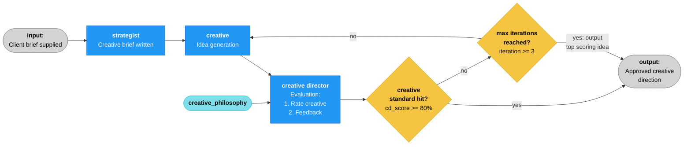

# 🌊 agt_sea

An AI-powered creative marketing tool for brands and agencies offering a number of services designed to improve creative output. 

The app is structured as a multipage Streamlit application with standalone modules for Strategy, Creative, and a full Workflow pipeline, plus a Tools page in development. The Creative page hosts two tabs — `c1_territory` (default) for Standard 2.0 territory generation via the Creative 1 agent, and `c0_original` for the original single-shot creative agent.

A Strategist writes the creative brief, a Creative generates ideas, and a Creative Director evaluates the work through a configurable creative philosophy. The system iterates until the work meets the quality threshold or the iteration budget is exhausted.

Built with LangGraph, LangChain, and Streamlit.

🔗 **[Live Demo](https://agt-sea.streamlit.app)**

---

## How It Works



The graph is defined in `graph/workflow.py` using LangGraph's `StateGraph`. Two conditional edges implement the approval gate and iteration limit. Routing functions are pure (return strings only). State mutations happen in dedicated finalisation nodes before `END`.

The Standard 2.0 multi-stage pipeline (ADR 0014) lives alongside v1 in `graph/workflow_v2.py`. It splits Creative into a territory-generation stage (Creative 1) and a campaign-development stage (Creative 2) with a human-in-the-loop interrupt between them: after Creative 1 generates territories, LangGraph's `interrupt()` primitive pauses the graph until the user selects one (or asks for a rerun with optional steering). The Creative Director role fans out into CD Grader, CD Feedback, and CD Synthesis. The v2 graph requires a checkpointer (a module-scope `MemorySaver` singleton) so the pause state survives across calls, and every `invoke()` / `stream()` call must carry `config={"configurable": {"thread_id": "<id>"}}`. Resume is `Command(resume={"action": ..., ...})` on a second call with the same thread. Boundary rehydration works identically to v1 — LangGraph returns a plain dict and call sites rehydrate with `AgencyState.model_validate(...)`. A Mermaid diagram for the v2 flow will land in `docs/architecture_v2.md` in Phase F.

### Agents

| Agent | File | Role | Output |
|-------|------|------|--------|
| **Strategist** | `agents/strategist.py` | Transforms the raw client brief into a focused creative brief | Challenge, audience, insight, proposition, tone |
| **Creative** (1.0) | `agents/creative.py` | Generates three distinct creative approaches per iteration | Concept title, core idea, execution, rationale |
| **Creative 1** (2.0) | `agents/creative1.py` | Generates *n* distinct creative territories from the brief (default 3, configurable 1–12 via `num_territories`). Optional `territory_rejection_context` steers a regenerated batch. | Structured `list[Territory]` — each with title, core idea, why it works |
| **Creative 2** (2.0) | `agents/creative2.py` | Develops a selected territory into a full campaign concept. Initial path works from the territory + brief; revision path incorporates the grader's score and the CD's coaching. | Structured `CampaignConcept` — title, core idea, deliverables, why it works |
| **Creative Director** (1.0) | `agents/creative_director.py`| Evaluates creative work through a chosen philosophical lens | Structured score (0–100), strengths, weaknesses, direction |
| **CD Grader** (2.0) | `agents/cd_grader.py` | Scores a campaign concept out of 100 against the brief. No philosophy / provenance / taste injection — objective and repeatable by contract. Temperature `0.0`. | Structured `GraderEvaluation` — score + rationale |
| **CD Feedback** (2.0) | `agents/cd_feedback.py` | Produces directional coaching for the next Creative 2 iteration. Reads the campaign concept and (when present) the grader's score and rationale. Does not score. | Free-text revision direction (`str`) |
| **CD Synthesis** (2.0) | `agents/cd_synthesis.py` | Final editorial judgement — the user-facing recommendation at the end of the Standard 2.0 pipeline. Schema supports N concepts (`comparison_notes` populated when >1, `None` when 1). | Structured `CDSynthesis` — selected title, recommendation narrative, per-concept score summary, comparison notes |

The Creative agent (1.0) has two prompt paths: initial generation (from brief only) and revision (incorporating CD feedback). It only sees the latest concept and latest feedback per iteration — not full history. Creative 2 (2.0) mirrors this two-path structure but incorporates the grader's score and the CD's coaching instead of a single CD evaluation.

The Creative Director (1.0), Creative 1, Creative 2, CD Grader, and CD Synthesis all use `with_structured_output()` to constrain LLM output to a validated Pydantic model. Schema validation failures get one reprompt through the shared helper `invoke_with_validation_retry` (in `llm/provider.py`) before surfacing as a FAILED run. CD Feedback produces free-text output instead — the revision direction itself is the product, so no schema is imposed.

The seven injection-using agents (Strategist, Creative, Creative 1, Creative 2, Creative Director, CD Feedback, CD Synthesis) build their system prompts via a module-level `_build_system_prompt()` helper. Each follows the *neutral-skip* rule: when the relevant lens is `NEUTRAL`, no section is injected and the prompt reads as if the feature wasn't there at all; otherwise the text is loaded from disk and injected into a dedicated section. Standard 2.0 agents compose three lenses (philosophy + provenance + taste); Standard 1.0 agents compose one (philosophy). The CD Grader is the exception: it is neutral by contract and takes no injection. The Strategist additionally assembles its prompt from a reusable creative-brief template and proposition guidance via `load_template()` / `load_guidance()`.


### Philosophies

Each agent runs through a configurable philosophical lens, set independently in the sidebar and stored on `AgencyState` as `strategic_philosophy`, `creative_philosophy`, and `cd_philosophy`. All three default to `neutral` (no lens injected).

**Creative philosophies** (shared by the Creative agent and Creative Director):

| Philosophy | Lens |
|-----------|------|
| Bold & Disruptive | Champions risk-taking and convention-breaking |
| Minimal & Refined | Values restraint, elegance, and precision |
| Emotionally Driven | Prioritises genuine human emotion and authenticity |
| Data Led | Demands strategic rationale grounded in evidence |
| Culturally Provocative | Champions cultural participation and relevance |

**Strategic philosophies** (used by the Strategist):

| Philosophy | Lens |
|-----------|------|
| Challenger | Positions the brand against a dominant incumbent or category orthodoxy |
| Human First | Leads from real human behaviour, needs, and tensions |
| Cultural Strategy | Reads cultural currents and gives the brand a role in them |
| Brand World | Builds a coherent brand universe with distinctive codes |
| Commercial Pragmatist | Prioritises clarity, commercial outcomes, and execution realism |

**Provenance and Taste** (Standard 2.0) — two additional prompt-injection categories scoped per creative role (Creative 1, Creative 2, CD). Filesystem-backed under `prompts/provenance/` and `prompts/taste/`, loaded via `load_provenance()` / `load_taste()` in `prompts/loader.py`. Same neutral-skip convention as the philosophies — callers check for `NEUTRAL` before loading. Initial `.txt` presets are placeholder prose to be replaced with real content later:

| Provenance | Lens |
|-----------|------|
| Northern Working Class | Grounded, anti-pretension, craft-over-abstraction instinct |
| Metropolitan Academic | Reads culture through theory; rigour, reference, layered interpretation |
| DIY Subculture | Improvisational, anti-institutional, energy over polish |

| Taste | Lens |
|-------|------|
| Underground / Referential | Deep-crate, reward-close-attention, distrusts work that shouts |
| Avant-Garde | Art-world-adjacent, radical, unresolved |
| Pop Maximalist | Big, loud, joyful, committed, earns its place in the feed |
| Craft Traditionalist | Long-lineage typography, headlines and images with staying power |

---

## Tech Stack

| Layer | Technology |
|-------|-----------|
| Orchestration | [LangGraph](https://github.com/langchain-ai/langgraph) |
| LLM Abstraction | [LangChain](https://github.com/langchain-ai/langchain) |
| Data Models | [Pydantic](https://docs.pydantic.dev/) |
| Frontend | [Streamlit](https://streamlit.io/) |
| Deployment | [Streamlit Cloud](https://streamlit.io/cloud) |
| Package Management | [uv](https://github.com/astral-sh/uv) |

### LLM Provider Support

The framework supports provider switching via configuration — change the `LLM_PROVIDER` environment variable to swap between:

- **Anthropic** (Claude) — default
- **Google** (Gemini)
- **OpenAI** (GPT)

---

## Data Model

Core state object: `AgencyState` (Pydantic `BaseModel` in `models/state.py`). This is the single source of truth passed through every graph node.

**Enums**: `WorkflowStatus`, `AgentRole`, `LLMProvider`, `CreativePhilosophy`, `StrategicPhilosophy`, `Provenance`, `Taste` — all `str, Enum` for type safety and serialisation. All four lens enums (philosophies + provenance + taste) include a `NEUTRAL` value that bypasses prompt injection entirely. `Provenance` and `Taste` are Standard 2.0 additions (see ADR 0014); their presets are placeholders at this stage.

**Supporting models**:
- `CDEvaluation` — structured evaluation used by Standard 1.0 (score 0–100 with validation, strengths, weaknesses, direction)
- `AgentOutput` — single agent output with metadata (agent, provider, model, iteration, content, timestamp, optional evaluation)
- `Territory` / `CampaignDeliverable` / `CampaignConcept` — Standard 2.0 creative artifacts (see ADR 0014). `Territory` is the atomic output of Creative 1; `CampaignConcept` is Creative 2's structured campaign (title, core idea, deliverables list, rationale)
- `GraderEvaluation` — Standard 2.0 grader output (score 0–100 + rationale only, no qualitative feedback)
- `CDSynthesis` / `ConceptScoreSummary` — Standard 2.0 final editorial judgement. Schema supports N concepts for the future parallel variant; the current graph passes one

**State design**: Dual access pattern — latest outputs at top level (`creative_brief`, `creative_concept`, `cd_evaluation`) for quick access by downstream agents, plus a full ordered `history: list[AgentOutput]` for traceability and UI display.

**Graph boundary**: LangGraph accepts `AgencyState` on the way in but returns a plain dict on the way out (and `stream()` yields per-node dict updates). Call sites that consume graph output — the Workflow page and the pipeline test — rehydrate with `AgencyState.model_validate(raw)` at the boundary so downstream code uses attribute access and typed nested models (`AgentOutput`, `CDEvaluation`). For streaming, per-node updates are merged into a running dict first and rehydrated once at the end.

**Key fields on AgencyState**:
- `client_brief` — the raw brief supplied by the user
- `strategic_philosophy` (default `neutral`) — shapes the Strategist's lens when writing the creative brief
- `creative_philosophy` (default `neutral`) — shapes the Creative agent's lens when generating ideas
- `cd_philosophy` (default `neutral`) — shapes the Creative Director's evaluation lens
- `llm_provider` (optional override) — when set, agents use this provider instead of the config default. Populated from the sidebar selector on each run.
- `llm_model` (optional override) — when set, agents use this model name instead of `get_model_name(provider)`. Populated from the sidebar selector on each run.
- `approval_threshold` (default `80.0`) — minimum CD score required for approval
- `max_iterations` (default `3`) — hard cap on creative loop iterations
- `iteration` — incremented by the Creative agent on each pass
- `status` — tracks workflow lifecycle via `WorkflowStatus` enum

Standard 2.0 extends the same state object (not a separate class). Additional fields slot into the existing groups (see [ADR 0014](docs/adr/0014-multi-stage-creative-pipeline.md)):
- Input lenses: per-role provenance + taste — `creative1_provenance`, `creative1_taste`, `creative2_provenance`, `creative2_taste`, `cd_provenance`, `cd_taste` (all default `neutral`). The CD pair is shared by CD Feedback and CD Synthesis; the CD Grader is always neutral by contract.
- Agent outputs — `territories`, `num_territories` (default `3`, range `1–12`), `selected_territory`, `territory_rejection_context`, `campaign_concept`, `grader_evaluation`, `cd_feedback_direction`, `cd_synthesis`.
- Run configuration — per-agent temperature: `creative1_temperature`, `creative2_temperature`, `cd_feedback_temperature`, `cd_synthesis_temperature` (default `0.7`) and `grader_temperature` (default `0.0`, hardcoded for repeatable scoring). All bounded `0.0–1.0` to stay inside Anthropic's cap.

Thresholds and max iterations are set per [ADR 0007](docs/adr/0007-revised-loop-thresholds.md), which supersedes the original values from [ADR 0006](docs/adr/0006-iterative-loop-design.md).

---

## Configuration

Application settings are centralised in `config.py` and accessed via helper functions. The `_get_secret()` helper reads from environment variables first, falling back to Streamlit secrets for cloud deployment.

A bridge at module load injects API keys from `st.secrets` into `os.environ` so LangChain providers (which read keys directly from the environment) work on Streamlit Cloud without modification.

Settings include: LLM provider, model name per provider, max iterations, approval threshold, transport retry count, and the public-demo run cap. All overridable via environment variables or Streamlit secrets:

- `LLM_PROVIDER`, `ANTHROPIC_MODEL`, `GOOGLE_MODEL`, `OPENAI_MODEL` — provider and per-provider model overrides
- `MAX_ITERATIONS` (default `3`) — hard cap on creative loop iterations
- `APPROVAL_THRESHOLD` (default `80.0`) — minimum CD score required for approval
- `LLM_MAX_RETRIES` (default `3`) — attempts made by `wrap_with_transport_retry()` on transient transport errors (see ADR 0012)
- `DEMO_RUN_CAP` (default `10`) — per-session run limit for the public demo (see ADR 0013)

**Default models** (local/development tier), defined in `config.DEFAULT_MODELS`:
- Anthropic: `claude-sonnet-4-6`
- Google: `gemini-3-flash-preview`
- OpenAI: `gpt-5.4-mini`

The set of models selectable in the sidebar lives in `config.AVAILABLE_MODELS` (one list per provider) — the sidebar imports this dict directly, so config is the single source of truth for both the default and the selectable options.

**Deployment note**: Streamlit Cloud uses per-provider model secrets (e.g. `ANTHROPIC_MODEL=claude-haiku-4-5-20251001`) set in the secrets dashboard for cost control. The sidebar model selector defaults to whatever the config resolves for the active provider.

**Temperature**: `get_llm()` accepts an optional `temperature: float | None` parameter. When `None` (the default) the argument is omitted from the underlying chat-model constructor and each provider's server-side default applies; when set it is passed through to `ChatAnthropic` / `ChatGoogleGenerativeAI` / `ChatOpenAI`. Standard 1.0 agents pass `temperature=0.7` explicitly to preserve their prior behaviour. Standard 2.0 agents read per-agent temperature from `AgencyState` (Creative 1, Creative 2, CD Feedback, CD Synthesis — default `0.7`; CD Grader hardcoded to `0.0` for repeatable scoring).

---


## Project Structure

```
agt_sea/
├── docs/
│   ├── architecture.md              # Mermaid graph diagram
│   └── adr/                         # Architecture Decision Records
├── src/
│   └── agt_sea/
│       ├── config.py                # Settings, env vars, st.secrets bridge
│       ├── agents/
│       │   ├── strategist.py        # Brief -> creative brief
│       │   ├── creative.py          # Creative brief -> concepts (1.0)
│       │   ├── creative1.py         # [2.0] Creative brief -> territories
│       │   ├── creative2.py         # [2.0] Selected territory -> campaign concept
│       │   ├── creative_director.py # Concepts -> evaluation (1.0)
│       │   ├── cd_grader.py         # [2.0] Campaign concept -> score + rationale
│       │   ├── cd_feedback.py       # [2.0] Campaign concept (+ optional score) -> revision direction
│       │   └── cd_synthesis.py      # [2.0] Campaign concept + history -> final editorial synthesis
│       ├── graph/
│       │   ├── workflow.py          # LangGraph orchestration (Standard 1.0)
│       │   └── workflow_v2.py       # [2.0] Multi-stage pipeline with territory-selection interrupt
│       ├── llm/
│       │   └── provider.py          # LLM provider abstraction
│       ├── models/
│       │   └── state.py             # Pydantic data models & enums
│       ├── prompts/
│       │   ├── loader.py            # load_prompt() + load_creative_philosophy / load_strategic_philosophy / load_provenance / load_taste / load_template / load_guidance
│       │   ├── templates/           # Reusable structural scaffolds (e.g. creative_brief.txt)
│       │   ├── guidance/            # Technique-specific guidance injected into agent prompts
│       │   ├── provenance/          # [2.0] One .txt file per non-NEUTRAL Provenance enum value
│       │   ├── taste/               # [2.0] One .txt file per non-NEUTRAL Taste enum value
│       │   └── philosophies/
│       │       ├── creative/        # One .txt file per CreativePhilosophy enum value
│       │       └── strategic/       # One .txt file per StrategicPhilosophy enum value
├── tests/
│   ├── _helpers.py                      # Shared test utilities (load_brief, print_entry_fields)
│   ├── test_strategist.py               # Strategist isolation test (manual, real LLM)
│   ├── test_creative.py                 # Strategist -> Creative test (manual, real LLM)
│   ├── test_creative1.py                # [2.0] Strategist -> Creative 1 test (manual, real LLM)
│   ├── test_creative2.py                # [2.0] Strategist -> Creative 1 -> Creative 2 test (manual, real LLM)
│   ├── test_pipeline.py                 # Full pipeline integration test (manual, real LLM)
│   ├── test_pipeline_v2.py              # [2.0] Full Standard 2.0 pipeline test (manual, real LLM) — pauses at interrupt, auto-selects territory[0]
│   ├── test_pipeline_failure.py         # Pipeline failure-path pytest unit tests
│   ├── test_creative_director_retry.py  # Validation-retry helper pytest unit tests (via CDEvaluation)
│   ├── test_cd_grader.py                # [2.0] GraderEvaluation schema + retry-helper bind pytest unit tests
│   ├── test_cd_synthesis.py             # [2.0] CDSynthesis / ConceptScoreSummary schema pytest unit tests
│   ├── test_llm_provider.py             # get_llm() / retry-wrapper pytest unit tests
│   └── test_run_guard.py                # Run guard counter pytest unit tests
├── frontend/
│   ├── app.py                       # Navigation shell (entry point, session state defaults)
│   ├── pages/
│   │   ├── strategy.py              # Standalone strategist
│   │   ├── creative.py              # Standalone creative
│   │   ├── workflow.py              # Full pipeline (tabbed)
│   │   ├── tools.py                 # Tools (holding message)
│   │   ├── marketing.py             # Placeholder (hidden)
│   │   ├── production.py            # Placeholder (hidden)
│   │   └── agnostic.py              # Placeholder (hidden)
│   ├── components/
│   │   ├── sidebar.py               # Logo, global params, footer
│   │   ├── agent_output.py          # Single agent output display
│   │   ├── history.py               # Pipeline history expanders
│   │   ├── run_metadata.py          # Run metrics bar
│   │   ├── progress.py              # Live node progress
│   │   ├── footer.py                # Footer badge
│   │   ├── error_state.py           # Failure UI (renders state.error on FAILED runs)
│   │   ├── run_guard.py             # Per-session run counter gate (ADR 0013)
│   │   ├── territory_cards.py       # [2.0] Renders list[Territory] as modular bordered cards
│   │   └── labels.py                # Shared enum → display-label mappings
│   └── themes/
│       └── b3ta.css                 # Theme CSS
├── .streamlit/
│   └── config.toml                  # Streamlit config (pins light theme)
├── briefs/
│   └── sample_brief_001.txt         # Sample client brief
├── pyproject.toml
├── .env.example
├── CLAUDE.md
├── LICENSE
└── README.md
```

## Coding Conventions

- All agents import LLM via `from agt_sea.llm.provider import get_llm` — never instantiate models directly
- State flows through `AgencyState` — agents read what they need and append to history
- Routing functions are pure (return strings, no state mutation) — state changes happen in dedicated nodes
- Type hints on all function signatures
- Every module and function should have a docstring
- `from __future__ import annotations` at the top of every file
- Enums for fixed vocabularies (providers, roles, statuses, philosophies) — never raw strings
- Config-driven where possible — defaults in code, environment overrides them
- Conventional commits style for commit messages (imperative mood)
- ADRs are append-only — new decisions get new numbered files; older ADRs are superseded rather than edited, with only the `Status:` line updated to flag the supersession
- All new files should follow existing patterns in the codebase

## File Conventions

- API keys: `.env` in project root (gitignored)
- Philosophy prompts: plain text files in `prompts/philosophies/creative/` and `prompts/philosophies/strategic/`, loaded by the convenience wrappers in `prompts/loader.py` (future: RAG-enhanced)
- Provenance and taste prompts (Standard 2.0): plain text files in `prompts/provenance/` and `prompts/taste/`, loaded by `load_provenance()` / `load_taste()` — same neutral-skip convention as the philosophy wrappers
- Prompt templates & guidance: plain text files in `prompts/templates/` and `prompts/guidance/`, loaded by `load_template()` / `load_guidance()` and composed inside agent `_build_system_prompt()` helpers
- Agent system prompts: assembled inline in agent files via `_build_system_prompt()` helpers that compose templates, guidance, and philosophy text
- Sample briefs: `briefs/` directory
- Architecture docs: `docs/architecture.md` (Mermaid)
- Decision records: `docs/adr/` (numbered markdown files + README index)

## Key Design Principles

- Modular architecture — each module is independently developable
- Provider-agnostic AI — switching between Anthropic, Google, OpenAI requires only a config/env change
- Iterative refinement — creative work improves through structured feedback loops with bounded execution
- Separation of routing and state — routing functions decide flow, nodes modify state
- Build incrementally — each phase produces something runnable
- Config over hardcoding — API keys, model names, thresholds, prompts all configurable
- Understand before extending — every file should be readable and explainable
- Clean, readable Python with clear separation of concerns
- Professional, portfolio-grade code and documentation

---

## Architecture Decisions

Key technical decisions are documented as Architecture Decision Records in [`docs/adr/`](docs/adr/):

- **ADR 0001** — LangGraph for orchestration
- **ADR 0002** — LangChain for LLM provider switching
- **ADR 0003** — Pydantic for state and data modelling *(boundary handling refined by ADR 0011)*
- **ADR 0004** — Structured output for CD evaluation
- **ADR 0005** — Streamlit for frontend
- **ADR 0006** — Iterative creative loop with bounded execution *(thresholds superseded by ADR 0007)*
- **ADR 0007** — Revised creative loop thresholds (80 / 3)
- **ADR 0008** — Multipage frontend architecture
- **ADR 0009** — LLM provider and model override mechanism
- **ADR 0010** — Filesystem-backed prompt injection pattern
- **ADR 0011** — Rehydrate LangGraph output to Pydantic at the boundary
- **ADR 0012** — Error handling and graceful degradation (two-layer retry, `FAILED` contract, `_safe_node` wrapper)
- **ADR 0013** — Demo abuse mitigation via per-session run counter
- **ADR 0014** — Multi-stage creative pipeline with territory selection (Standard 2.0)

## Build Sequence

1. **MVP — Creative Pipeline** ← COMPLETE (deployed to Streamlit Cloud)
2. **Standalone Strategic Agents (e.g. creative brief writer**)** ← COMPLETE (standalone, calls `run_strategist()` directly)
3. **Standalone Creative Agents (discipline-specific specialists, different creative types)** ← COMPLETE (standalone, calls `run_creative()` directly)
4. **Error handling & graceful degradation (retries, failure contract)** ← COMPLETE (Phase 6.1 / ADRs 0012 & 0013)
5. RAG-enhanced creative philosophies
6. Human-in-the-loop approval points
7. Structured logging & tracing (LangSmith)
8. Brand Strategy Module (branding / brand positioning)
9. Provider comparison tooling

---

## Status

🟢 **Multipage app deployed** — multipage Streamlit frontend with standalone Strategy, Creative, and Workflow modules. Deployed to Streamlit Cloud with auto-deploy on push.

### Roadmap

**Phase 6 — Refinement (current)**
- [ ] Frontend refinement and UX polish
- [x] Error handling and graceful degradation
- [ ] Human-in-the-loop approval points (LangGraph interrupt/resume)
- [ ] Structured logging and tracing (LangSmith)

**Standard 2.0 — Multi-Stage Creative Pipeline ([ADR 0014](docs/adr/0014-multi-stage-creative-pipeline.md))**

Splits creative into a two-stage pipeline with a territory-selection interrupt: Creative 1 generates N territories, the user picks one, Creative 2 develops it into a full campaign, and the Creative Director role fans out into Grader, Feedback, and Synthesis. Provenance and Taste join Philosophy as per-role prompt-injection lenses.

- [x] State model, new enums, new agent conventions (Phase A)
- [x] Prompt infrastructure, temperature support, sidebar controls (Phase B)
- [x] Creative 1 agent + standalone Creative page tab (Phases C1 / C-FE)
- [x] Creative 2, CD Grader, CD Feedback, CD Synthesis agents (Phase C2)
- [x] v2 graph with territory-selection interrupt (Phase D)
- [ ] Workflow page Standard 2.0 / 1.0 tabs (Phase E)
- [ ] End-to-end testing, architecture diagram, docs sweep (Phase F)

**Future Modules**
- [ ] Tools - a suite of creative tools (page visible with holding message)
- [ ] Marketing - Standalone marketing agent(s) (placeholder page exists)
- [ ] Production - Production services (e.g. Image, Audio, Film, Social content generation) (placeholder page exists)
- [ ] Agnostic - Miscellaneous (placeholder page exists)
---

## Getting Started

### Prerequisites

- Python 3.11+
- [uv](https://github.com/astral-sh/uv) package manager
- An API key for at least one supported LLM provider

### Installation

```bash
# Clone the repo
git clone https://github.com/b3tascape/agt-sea.git
cd agt-sea

# Install dependencies
uv sync
uv pip install -e .

# Set up environment variables
cp .env.example .env
# Edit .env and add your API key(s)
```

### Run the Frontend locally

```bash
uv run streamlit run frontend/app.py
```

### Run full pipeline test (makes real LLM calls)

```bash
uv run python tests/test_pipeline.py
```

### Run individual agent tests

```bash
uv run python tests/test_strategist.py
uv run python tests/test_creative.py
uv run python tests/test_creative1.py
uv run python tests/test_creative2.py
```

### Interactive pipeline exploration

```bash
uv run python -i tests/test_pipeline.py
# Then: final_state["history"][0].agent, final_state["status"], etc.
```

---

## License

MIT — see [LICENSE](LICENSE) for details.